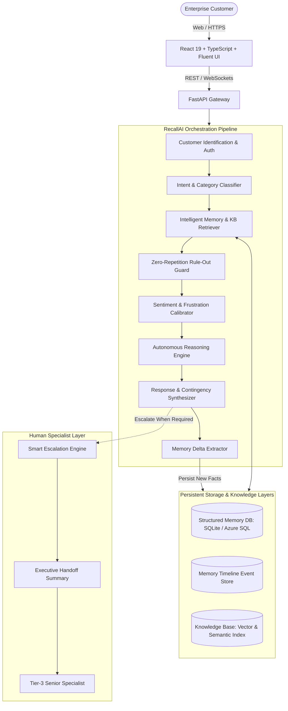

# RecallAI — Customer Support That Remembers

> **"RecallAI — Your Support Agent Remembers, So You Don't Have To."**
> 
> *A production-quality Microsoft Hackathon project showcasing persistent, cross-session customer memory, autonomous zero-repetition troubleshooting, and Microsoft Fluent enterprise architecture.*

---

## 🚀 The Vision

In modern enterprise support, customers face an infuriating experience:
**"Customers should never have to repeatedly explain the same problem."**

Traditional AI chatbots only remember the current active chat session. The moment a customer closes the window and returns next week, the AI asks:
- *"What operating system are you running?"*
- *"What version is your software?"*
- *"Have you tried clearing your cache?"*

**RecallAI completely transforms this dynamic.** It establishes a persistent, cross-session customer memory architecture that maintains situational awareness of:
- Past support cases and open unresolved tickets
- Exact technical environment specifications (OS, cloud setup, runtime, hardware)
- Previously attempted solutions that **failed** (so it NEVER recommends them again)
- Previously verified solutions that **worked**
- Customer baseline frustration and conversational sentiment
- Evolution of the customer's issues across time

---

## 🌟 Hackathon WOW Features

| Feature | Description |
| :--- | :--- |
| 🔍 **"Memory Used" Transparent Inspector** | Every AI response features a collapsible "Memory Used" badge revealing the exact tickets, ruled-out failed steps, environment attributes, and KB articles recalled to formulate the answer. |
| 🚫 **Zero-Repetition Protocol Guarantee** | Before suggesting any troubleshooting step, RecallAI checks customer memory and explicitly rules out previously failed solutions (e.g., *"Given that clearing the local cache failed last Thursday, we will not repeat that step..."*). |
| ⏱️ **Visual Customer Memory Timeline** | A chronological interactive event trail displaying the evolution of support cases, software version updates, and remediation attempts from August to September 2026. |
| 🕸️ **Related Ticket Graph** | A visual interconnected network connecting recurring tickets, version migration regressions, and subsystem dependencies. |
| ⚡ **1-Click Smart Escalation Handoff Brief** | Autonomous executive case summary generator that equips Tier-3 human engineers with a zero-repetition brief in one click. |
| 🎭 **Sentiment & Frustration Calibration** | Detects conversational signals (`CALM`, `CONFUSED`, `FRUSTRATED`, `URGENT`) and dynamically calibrates response style—skipping pleasantries and leading with immediate ownership for high-frustration users. |
| 🔄 **Resolution Learning Engine** | When a customer confirms a troubleshooting step worked, RecallAI extracts and verifies it as a persistent successful resolution for future sessions. |

---

## 🏛️ System Architecture



---

## 👥 5 Seeded Enterprise Customer Personas

RecallAI is pre-seeded with **5 realistic enterprise customers**, **15 historical tickets**, and rich memory profiles:

1. **Marcus Vance — Contoso Ltd. (Enterprise Premier)**
   - *Role:* Principal DevOps Engineer
   - *Environment:* Ubuntu 22.04 LTS, Docker 24.0.7, Azure DevOps Server 2022, Self-hosted runner-03
   - *Frustration Baseline:* 8.5 / 10.0 (Critical)
   - *Ruled-Out Steps:* Increasing timeout to 120m (failed), restarting agent daemon (temporary fix only).
   - *Diagnosis:* Linux cgroup memory throttling and unreleased dead containers.

2. **Sarah Jenkins — Fabrikam Dynamics (Enterprise)**
   - *Role:* Lead Product Manager
   - *Environment:* Windows 11 Enterprise (23H2), Intel Core i7, 32GB RAM, Studio v4.2.0
   - *Frustration Baseline:* 6.5 / 10.0 (Frustrated)
   - *Ruled-Out Steps:* Clearing local cache (failed), full reinstall (failed).
   - *Diagnosis:* DirectX 12 hardware acceleration shader cache corruption on Windows 11.

3. **David Chen — Northwind Cloud (Enterprise)**
   - *Role:* Enterprise Systems Architect
   - *Environment:* Windows Server 2022 Datacenter, Azure AD Connect v2.1.20
   - *Ruled-Out Steps:* Local network MTU renegotiation.
   - *Diagnosis:* Azure AD Connect delta sync throttling bypass and Graph API token validation.

4. **Elena Rostova — Trey Research (Premier)**
   - *Role:* Senior Backend Lead
   - *Environment:* macOS Sonoma 14.4, Node.js 20 LTS, Microservices Gateway
   - *Ruled-Out Steps:* Disabling HTTP keep-alive on outbound dispatcher.
   - *Diagnosis:* TLS 1.3 intermediate CA chain verification gap (Let's Encrypt ISRG Root X1).

5. **Alex Rivera — Woodgrove Financial (Enterprise Critical)**
   - *Role:* Data Infrastructure Lead
   - *Environment:* Debian 12 (Bookworm), PostgreSQL 16.2, PgBouncer 1.21
   - *Ruled-Out Steps:* Raising max_connections in postgresql.conf (triggered kernel OOM swap thrashing).
   - *Diagnosis:* PgBouncer transaction pooling starvation and idle-in-transaction connection reaping.

---

## 🛠️ Technology Stack (Microsoft Ecosystem)

- **Frontend:** React 19, TypeScript, Vite, Tailwind CSS v4, Lucide Icons, Microsoft Fluent-inspired aesthetic.
- **Backend:** Python 3.11+, FastAPI, SQLAlchemy, Pydantic v2, Uvicorn.
- **AI Core:** Azure OpenAI Service (GPT-4o) / High-precision built-in contextual reasoning engine with fallback.
- **Database:** SQLite / PostgreSQL / Azure SQL Database.
- **Vector Retrieval:** Azure AI Search / Hybrid keyword and cosine semantic ranking.
- **Identity & Security:** Microsoft Entra ID (Azure AD) compatible SSO & RBAC.
- **Containerization:** Docker & Docker Compose.

---

## ⚡ Quick Start Guide

### Prerequisites
- Python 3.10+
- Node.js 18+ & npm

### Step 1: Clone and Setup Backend
```powershell
# Navigate to project directory
cd "c:\Users\tvish\Desktop\Customer Support Agent"

### Option A: 1-Click Unified Main Web (Recommended)
Double-click `start_web.bat` or run:
```powershell
.\start_web.bat
```
*Opens the entire unified application on `http://localhost:8000` (Frontend, API, WebSockets, and Swagger docs all on one port).*

### Option B: Unified Live Tunnel (Public HTTPS)
Double-click `start_live.bat` or run:
```powershell
.\start_live.bat
```
*Launches the unified web server and Cloudflare tunnel on `http://localhost:8000`.*

### Option C: Development Mode (Hot-Reload)
```powershell
.\start_dev.bat
```

### Option D: Docker Container Deployment
```bash
docker compose up --build
```

---

## 🧪 Testing the 5 Hackathon Scenarios in the UI

1. Open `http://localhost:8000` in your browser.
2. In the top navigation bar, click the **"Demo Scenarios"** dropdown.
3. Select any scenario (e.g. **Marcus Vance — Pipeline Timeout**).
4. Notice how RecallAI automatically:
   - Switches customer profile to Marcus Vance (Ubuntu 22.04 LTS / runner-03).
   - Populates the prompt: *"It's happening again on runner-03. Same timeout error as Tuesday. Fix this."*
5. Click **Send** and watch RecallAI:
   - Identify Ticket #8841.
   - Explicitly rule out the 120m timeout increase and daemon restart.
   - Prescribe Linux `systemctl` memory diagnostics and Docker cleanup.
   - Calibrate sentiment to **URGENT**.
   - Render the **"Memory Used"** inspector.
6. Switch to the **Agent Dashboard** via the top toggle to explore the **Memory Timeline**, **Related Ticket Graph**, and **Smart Escalations**.

---

## 📄 License
MIT License. Built for the Microsoft AI Hackathon.
