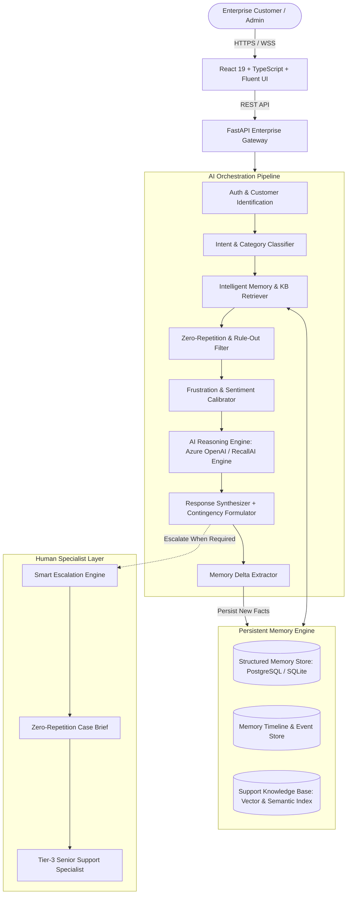

# RecallAI — Architectural Blueprint & Systems Specification
**"Customer Support That Remembers"**
*Microsoft AI Hackathon Edition*

---

## 1. Executive Summary & Problem Formulation

In modern enterprise support, customers are routinely subjected to redundant questioning: *"What operating system are you on?", "Have you cleared your cache?", "Can you reboot the server?"* For high-stakes enterprise clients running complex DevOps, identity, or database clusters, this cycle causes extreme frustration, prolongs Mean Time to Resolution (MTTR), and erodes confidence in the support organization.

**RecallAI** solves this problem by establishing a persistent, cross-session customer memory architecture. Unlike traditional chatbots that only retain context within a single ephemeral chat session, RecallAI maintains persistent awareness across months of support interactions, technical environment changes, failed troubleshooting steps, and verified successful resolutions.

---

## 2. High-Level System Architecture

---

## 3. Persistent Memory Architecture

RecallAI decomposes customer history into two specialized memory layers:

### A. Structured Memory Layer
Stores deterministic entities representing the customer's technical environment and operational history:
- **Customer Profile:** Unique ID, Organization, Tier (Enterprise Premier), Baseline Frustration Score.
- **Environment Matrix:** OS name/version, Cloud provider, Application version, Hardware/CPU tier, Runtime dependencies.
- **Rule-Out Memory (Failed Solutions):** Explicitly records every troubleshooting attempt that failed, along with root-cause rationale. **The AI is strictly prohibited from re-recommending these solutions.**
- **Verified Solutions:** Troubleshooting steps confirmed by the customer to resolve past incidents.
- **Active & Historical Tickets:** Full ticket records with associated categories and recurrence links.

### B. Conversational & Timeline Memory Layer
Rather than blindly storing raw unstructured conversational chat logs, RecallAI extracts semantic events into an immutable **Memory Timeline**:
- Dates of software updates (e.g., `2026-09-03: App updated to v4.2.0`)
- Dates of incident recurrence (e.g., `2026-09-27: Pipeline timeout recurrence on runner-03`)
- Changes in customer hardware or runtime settings.

---

## 4. Intelligent Memory Retrieval & Context Assembly

When a customer submits an inquiry, the retrieval engine follows a strict multi-tier ranking strategy:

1. **Intent & Category Classification:** Discovers whether the message is a crash, pipeline failure, sync latency, SSL timeout, or database lock issue.
2. **Priority 1 — Active Unresolved Tickets:** Immediately correlates the issue with open or recently closed tickets in the same category.
3. **Priority 2 — Failed Solutions Filter:** Retrieves all past failed troubleshooting steps to populate the **Zero-Repetition Rule-Out Guard**.
4. **Priority 3 — Environment Parameters:** Tailors commands (e.g. `journalctl` vs PowerShell) to the customer's verified environment.
5. **Priority 4 — Knowledge Base Search:** Retrieves authoritative Microsoft/Enterprise resolution playbooks.
6. **Context Conciseness:** Formulates an assembled prompt containing only relevant context, preventing token bloat and hallucination.

---

## 5. Frustration & Sentiment Calibration Engine

RecallAI monitors explicit conversational signals (e.g., keywords such as *"again"*, *"third time"*, *"timeout"*, *"urgent"*, all-caps input):
- **CALM:** Provides conversational, technical guidance.
- **CONFUSED:** Provides progressive, step-by-step clarity.
- **FRUSTRATED:** Skips corporate pleasantries, leads immediately with ownership and actionable next steps.
- **URGENT:** Executes immediate diagnostic commands and prepares contingency escalation paths.

---

## 6. Microsoft Ecosystem Integration Architecture

RecallAI is engineered to integrate natively with Microsoft cloud services:
- **AI Core:** Azure OpenAI Service (GPT-4o / GPT-4 Turbo) via enterprise endpoints.
- **Database:** Azure SQL Database / PostgreSQL with pgvector for semantic search.
- **Search & Retrieval:** Azure AI Search with hybrid keyword-vector indexing.
- **Authentication:** Microsoft Entra ID (Azure AD) for enterprise single sign-on (SSO) and role-based access control (RBAC).
- **Diagnostics:** Azure Monitor and Application Insights for telemetry and audit logging.
- **UI Aesthetic:** Microsoft Fluent Design System with Segoe UI typography and acrylic styling.
